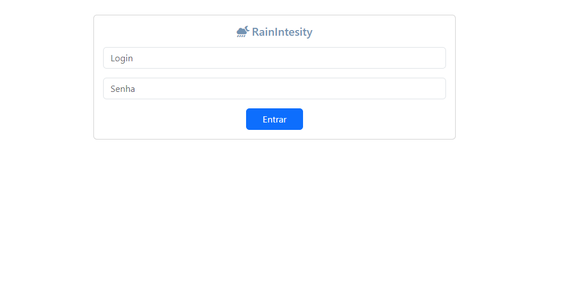
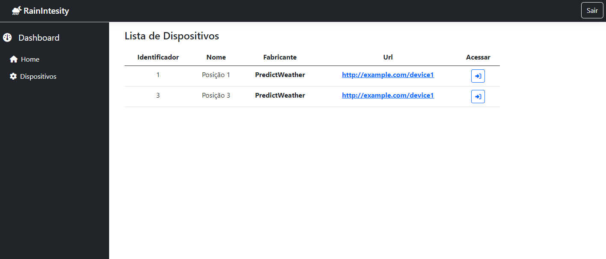

## Uso de Interface Minimalista

Optei por uma interface minimalista para a aplicação. Isso foi decidido para garantir uma experiência de usuário limpa e livre de distrações. Acreditamos que uma interface simples é mais intuitiva e fácil de usar, especialmente para uma ferramenta tão fundamental de medidor de Intensidade de chuva.

## Implementações

Neste projeto, foi realizada a implementação do JSON Web Token (JWT) para autenticação de usuários. Apesar de possuir um conhecimento inicial limitado sobre essa ferramenta, consegui compreender o funcionamento do JWT, mesmo enfrentando alguns desafios na sua utilização.

Neste projeto, desenvolvi uma API utilizando o framework .NET Core para lidar com autenticação de usuários e acesso aos dados de dispositivos de medição de chuva. A implementação foi realizada utilizando um arquivo JSON para simular um banco de dados com as informações dos dispositivos.

## Sugestões e Melhorias
Durante o desenvolvimento do projeto, embora não tenho tido tempo para implementar o Telnet, fiz pesquisas sobre sua utilização e identifiquei alguns desafios e limitações:

### Problemas com o Telnet
O Telnet é uma ferramenta que permite a comunicação com outros dispositivos em uma rede por meio do protocolo Telnet. No entanto, ele apresenta algumas desvantagens significativas:

Segurança: O Telnet envia dados, incluindo senhas, sem criptografia. Isso significa que as informações sensíveis podem ser interceptadas facilmente por invasores, representando um risco de segurança.

Autenticação: O Telnet não oferece um mecanismo robusto de autenticação. Isso pode resultar em problemas de segurança, pois qualquer pessoa com acesso à rede pode se conectar aos dispositivos sem a necessidade de credenciais válidas.

Gerenciamento de Sessões: O Telnet não possui recursos avançados de gerenciamento de sessões, o que pode dificultar a manutenção e o controle das conexões com os dispositivos.

### Alternativas Recomendadas
Considerando os problemas mencionados acima, recomendo a utilização de alternativas mais seguras e eficientes para comunicação com dispositivos de medição de chuva:

SSH (Secure Shell): O SSH é uma alternativa mais segura ao Telnet, pois oferece criptografia de ponta a ponta para proteger os dados durante a comunicação. Além disso, possui recursos avançados de autenticação, como chaves públicas e privadas, garantindo uma camada adicional de segurança.

API RESTful: Se possível, uma abordagem mais moderna seria desenvolver uma API RESTful nos dispositivos de medição de chuva. Isso permitiria que os clientes se comunicassem com os dispositivos por meio de solicitações HTTP seguras e padronizadas, facilitando a integração e o desenvolvimento de aplicativos clientes.

Protocolos Específicos de Dispositivos: Dependendo dos dispositivos de medição de chuva em questão, pode haver protocolos específicos de comunicação projetados para interagir com esses dispositivos de maneira segura e eficiente. Investigar e utilizar esses protocolos pode ser uma opção viável.

Ao adotar uma abordagem mais segura e moderna para a comunicação com os dispositivos de medição de chuva, podemos mitigar os riscos de segurança e garantir uma integração mais eficiente e confiável com o sistema.

#### Dicas:
Na pasta dentro da Api/Contoller rodar no cmd o comando json-server --watch devices.json, para simular o arquivo jason em um servidor e api conectar com ele.
